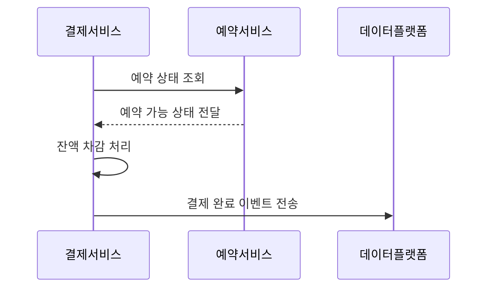
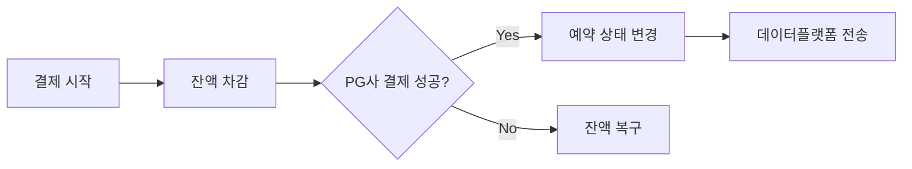

# MSA 전환 및 트랜잭션 분리 설계 보고서
---

## 목차
1. [서비스 분리 전략](#1-서비스-분리-전략)  
2. [트랜잭션 처리의 한계](#2-트랜잭션-처리의-한계)  
3. [해결 방안](#3-해결-방안)  
  3.1 [Spring Event를 이용한 비동기 처리](#31-spring-event를-이용한-비동기-처리)  
  3.2 [SAGA 패턴](#32-saga-패턴)  
  3.3 [Outbox 패턴](#33-outbox-패턴)  
4. [결론](#4-결론)  

---

## 1. 서비스 분리 전략
### 도메인별 분리 구성
- **예약**  
  ```java
  예약_Tx() {
      좌석_상태_점유로_업데이트();
      스케줄_잔여_티켓_수_업데이트();
      예약_신청();
  }
  ```

- **결제**  
  ```java
  결제_Tx() {
      예약_정보_조회();
      잔액_차감();
      좌석_상태_비점유로_업데이트();
      스케줄_잔여_티켓_수_업데이트();
      결제_정보_생성();
      유저_대기열_토큰_제거();
      데이터_플랫폼_전송();  // 결제 정보 전송 (구현 예정)
  }
  ```

### 분산 환경에서의 트랜잭션 흐름


---

## 2. 트랜잭션 처리의 한계
### 예상되는 주요 문제점
1. **부분 실패 시 데이터 불일치**  
   - 결제 성공 후 예약 상태 변경 실패 시 사용자 잔액 복구 필요
2. **외부 시스템 의존성**  
   - PG사 API 장애가 전체 트랜잭션 실패로 직결
3. **성능 저하**  
   - 5초 이상의 장기 트랜잭션 발생 가능성

### 사례 시나리오
```java
// 기존 모놀리식 결제 로직
@Transactional 
public PaymentResult createPayment() {
    reservationService.updateReservation();    // 예약 상태 변경 (외부 서비스 호출)
    userService.use();                     // 잔액 차감
    concertService.updateSeatStatus();    // 좌석 상태 변경
    concertService.updateScheduleRemainingTicket(); // 잔여 티켓 수 변경
    paymentService.createPayment(); // 결제 정보 생성
    queueService.removeQueue();     // 유저 대기열 토큰 제거
    sendToDataPlatform();    // 데이터 플랫폼 전송 (구현 예정)
}
```

---

## 3. 해결 방안
### 3.1 Spring Event를 이용한 비동기 처리
#### 아키텍처 구성


#### 구현 예시
```java
// 이벤트 발행 로직
@Transactional
public void completePayment(Payment payment) {
    paymentRepository.save(payment);
    eventPublisher.publishEvent(new PaymentCompletedEvent(payment.getId()));
}

// 이벤트 핸들러
@TransactionalEventListener(phase = AFTER_COMMIT)
public void handlePaymentEvent(PaymentCompletedEvent event) {
    reservationService.updateStatus(event.getPaymentId());
    dataPlatformService.send(event.getPaymentId());
}
```

#### 장단점 비교
| 장점                                  | 단점                                  |
|---------------------------------------|---------------------------------------|
| 서비스 간 결합도 감소                 | 이벤트 전달 보장 필요                 |
| 장애 전파 방지                        | DLQ(Dead Letter Queue) 구현 필수     |

---

### 3.2 SAGA 패턴
#### 코레오그래피 방식 구현


#### 보상 트랜잭션 예시
```java
public void compensatePayment(Long paymentId) {
    paymentRepository.findById(paymentId).ifPresent(payment -> {
        userService.refund(payment.getUserId(), payment.getAmount()); // 환불 처리
        paymentRepository.delete(payment);
    });
}
```

---

### 3.3 Outbox 패턴
#### 데이터 일관성 보장 구조
```java
// 트랜잭션과 함께 Outbox 저장
@Transactional
public void 결제_처리() {
    결제_정보_저장();
    outboxRepository.save(new Outbox("결제완료", 결제ID));
}

// 별도 스케줄러가 Outbox 폴링 후 이벤트 전송
@Scheduled(fixedDelay = 5000)
public void 이벤트_전송() {
    List<Outbox> events = outboxRepository.findAll();
    events.forEach(event -> {
        kafkaTemplate.send(event.getType(), event.getPayload());
        outboxRepository.delete(event);
    });
}
```

#### 구현 단계
1. 트랜잭션과 함께 Outbox 테이블에 이벤트 저장
2. 별도 스케줄러가 Polling 방식으로 이벤트 전송
3. 메시지 브로커(Kafka)를 통한 이벤트 배포

```sql
CREATE TABLE outbox (
    id BIGINT AUTO_INCREMENT PRIMARY KEY,
    aggregate_type VARCHAR(255) NOT NULL,
    payload JSON NOT NULL,
    created_at TIMESTAMP DEFAULT CURRENT_TIMESTAMP
);
```

---

## 4. 결론
### 주요 구현 전략 요약
MSA 환경에서 트랜잭션 일관성을 유지하기 위해 Spring Event, SAGA 패턴, Outbox 패턴 등 다양한 전략을 적용할 수 있다. 각 전략은 다음과 같은 특징을 가진다.

- **Spring Event**: 단일 서비스 내 비동기 이벤트 처리에 적합하며, 최종 일관성을 제공한다.  
- **SAGA 패턴**: 크로스 서비스 트랜잭션 관리에 효과적이며, 보상 트랜잭션을 통해 부분 실패 시 데이터 일관성을 유지한다.  
- **Outbox 패턴**: 이벤트 전달 보장을 통해 강한 일관성을 제공하지만, 추가적인 스토리지와 프로세스가 필요하다.  

### 향후 개선 방향
1. **모니터링 강화**: OpenTelemetry를 도입하여 분산 트랜잭션 추적 및 장애 대응 체계를 강화한다.  
2. **테스트 자동화**: Chaos Engineering을 활용해 장애 시뮬레이션을 정기적으로 수행하여 시스템 견고성을 검증한다.  
3. **인프라 개선**: Kafka 클러스터 확장 및 성능 최적화를 통해 대규모 트래픽 환경에서의 안정성을 확보한다.  

### 최종 정리
MSA 전환은 확장성과 유연성을 제공하지만, 분산 트랜잭션 관리의 복잡성이 주요 과제이다. 적절한 트랜잭션 전략과 모니터링, 테스트 자동화, 인프라 개선을 통해 안정적이고 확장 가능한 서비스를 구축할 수 있다.
