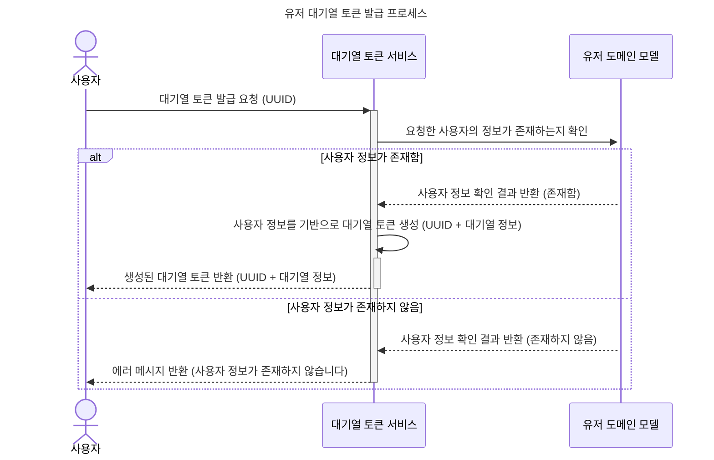
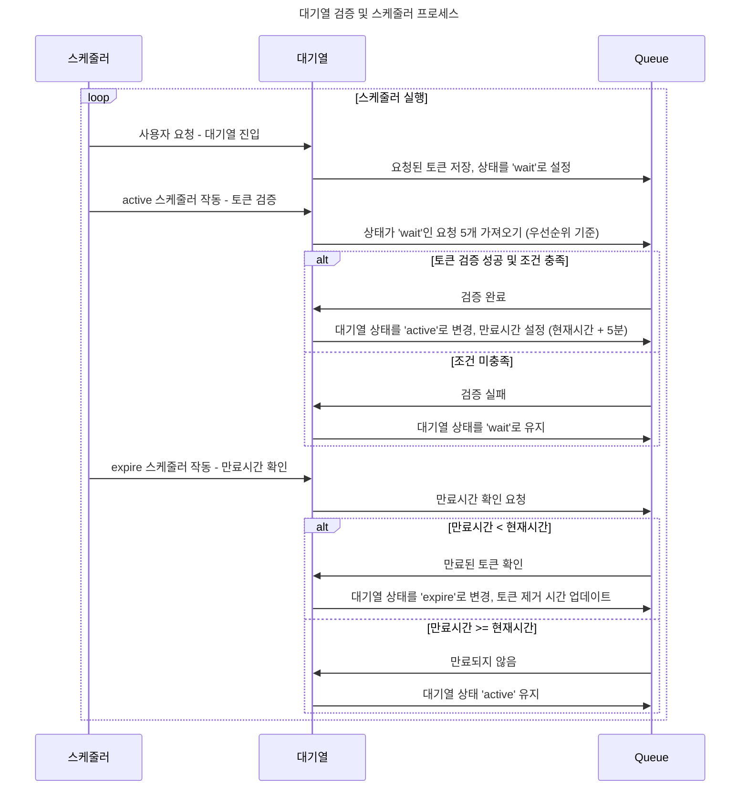
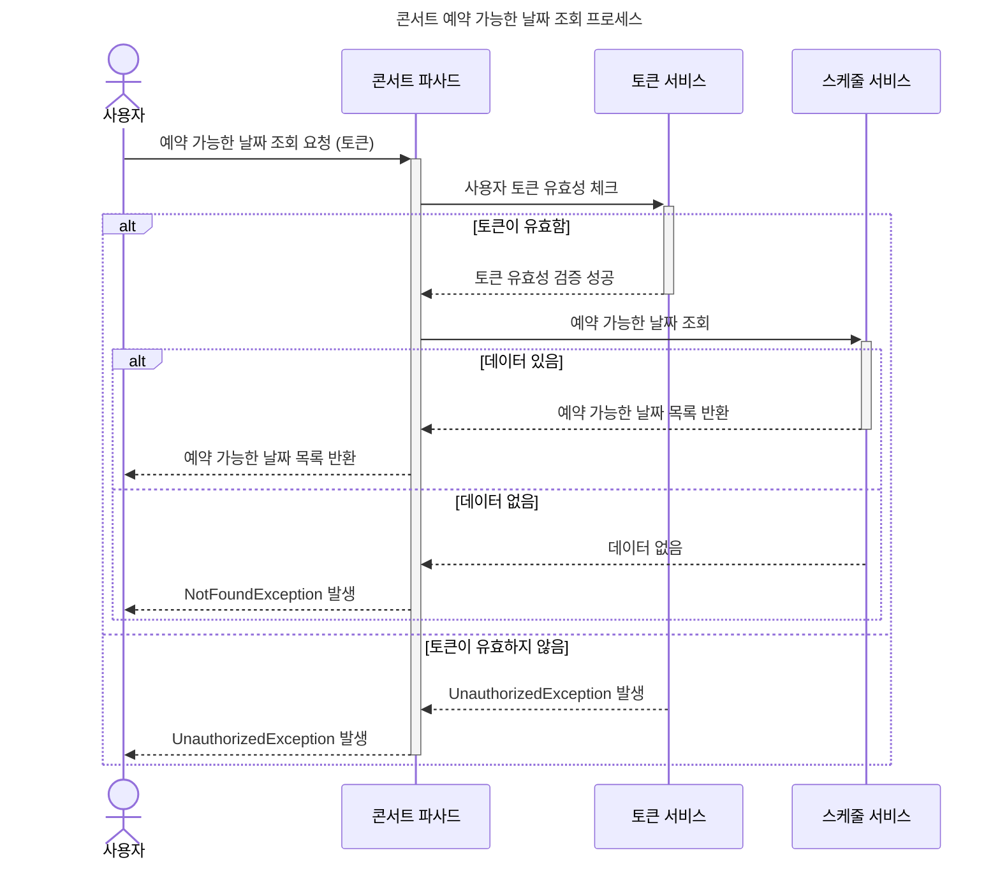
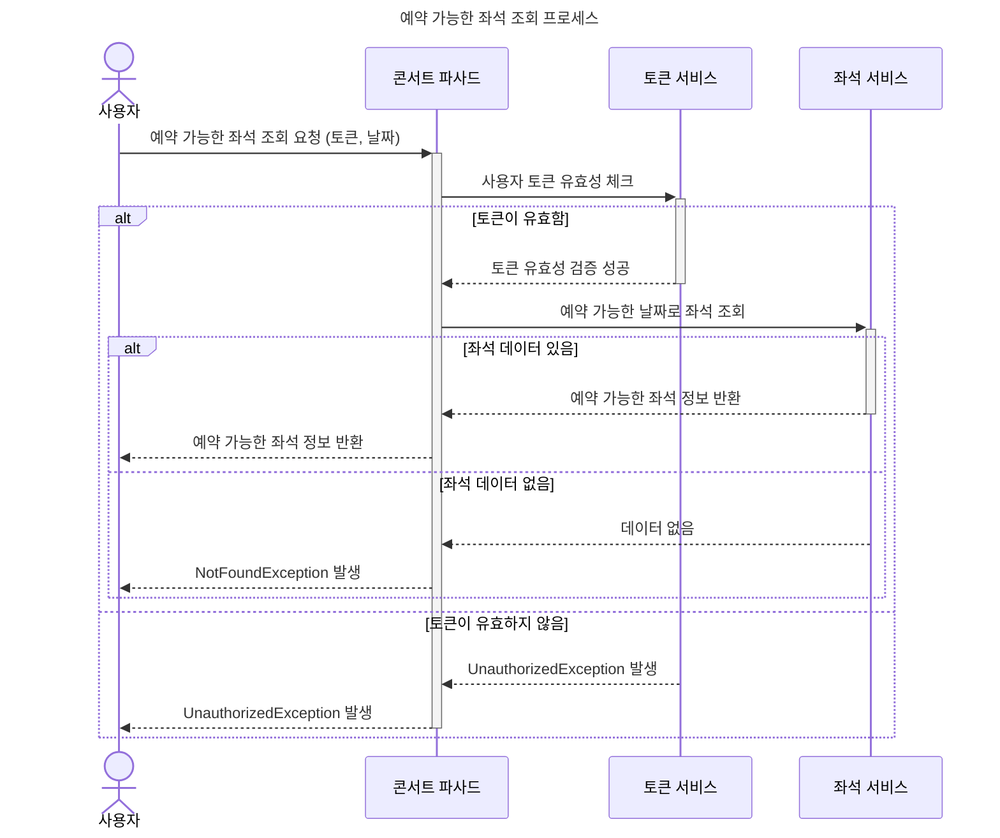
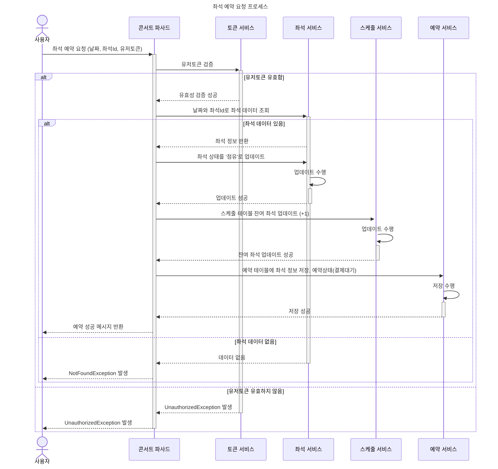
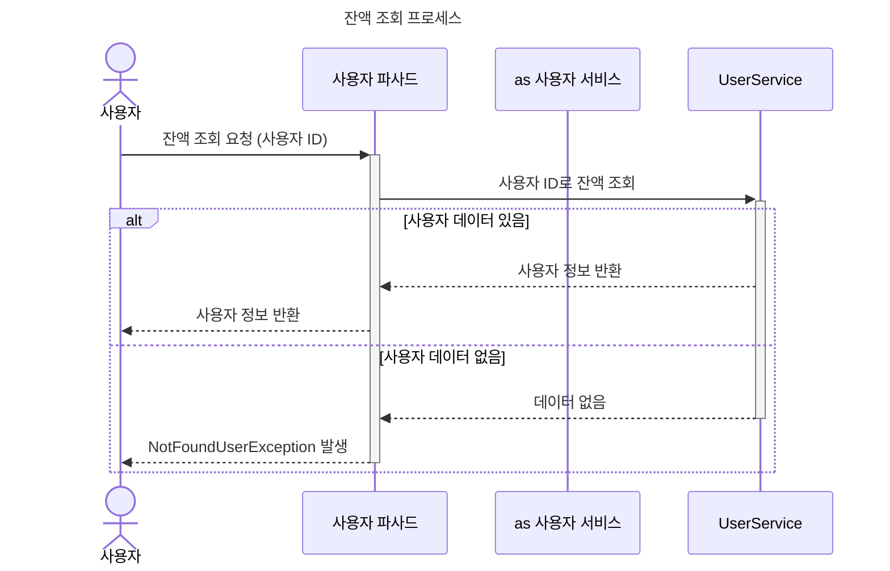
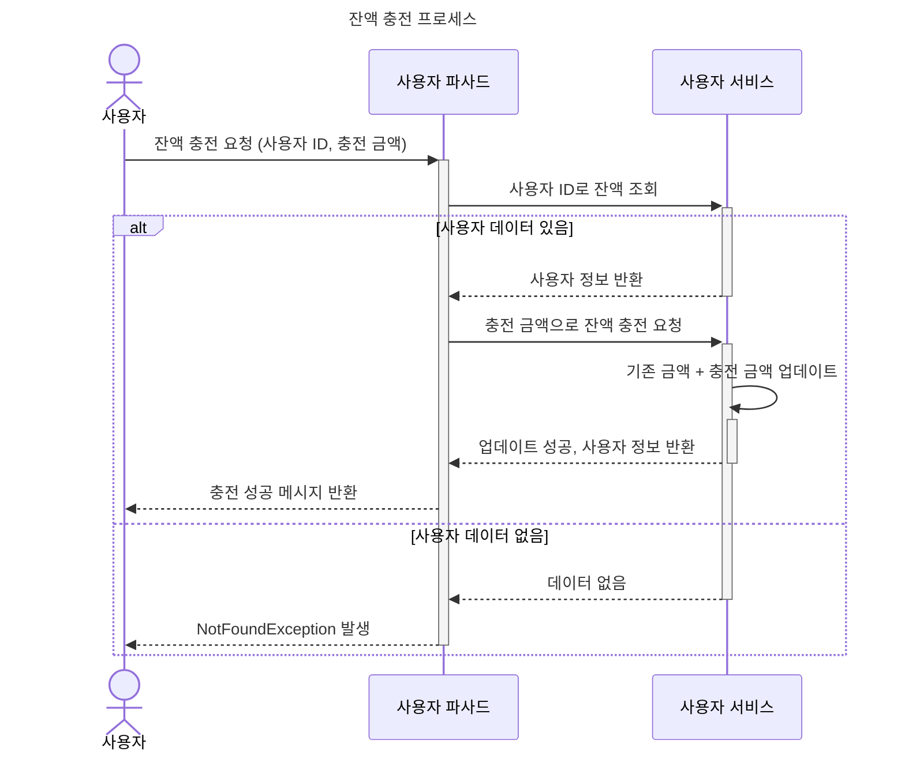
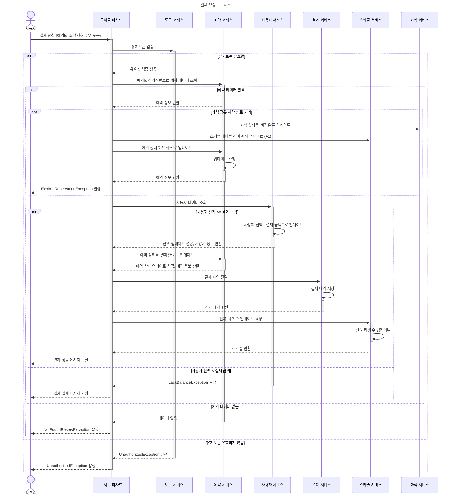

# 콘서트 예약 서비스 시퀀스 다이어그램
## 1. 유저 대기열 토큰 발급 API

```mermaid
---
config:
  theme: default
---
sequenceDiagram
    title 유저 대기열 토큰 발급 프로세스
    actor 사용자 as 사용자
    participant 서비스 as 대기열 토큰 서비스
    participant 유저도메인모델 as 유저 도메인 모델

    사용자->>+서비스: 대기열 토큰 발급 요청 (UUID)
    서비스->>+유저도메인모델: 요청한 사용자의 정보가 존재하는지 확인
    alt 사용자 정보가 존재함
        유저도메인모델-->>서비스: 사용자 정보 확인 결과 반환 (존재함)
        서비스->>+서비스: 사용자 정보를 기반으로 대기열 토큰 생성 (UUID + 대기열 정보)
        서비스-->>-사용자: 생성된 대기열 토큰 반환 (UUID + 대기열 정보)
    else 사용자 정보가 존재하지 않음
        유저도메인모델-->>서비스: 사용자 정보 확인 결과 반환 (존재하지 않음)
        서비스-->>-사용자: 에러 메시지 반환 (사용자 정보가 존재하지 않습니다)
    end
```
## 2. 대기열 검증 및 스케줄러

```mermaid
---
config:
  theme: default
---
sequenceDiagram
    title 대기열 검증 및 스케줄러 프로세스
    participant 스케줄러 as 스케줄러
    participant 대기열 as 대기열
    participant 큐 as Queue

    loop 스케줄러 실행
        스케줄러->>대기열: 사용자 요청 - 대기열 진입
        대기열->>큐: 요청된 토큰 저장, 상태를 'wait'로 설정

        스케줄러->>대기열: active 스케줄러 작동 - 토큰 검증
        대기열->>큐: 상태가 'wait'인 요청 5개 가져오기 (우선순위 기준)
        alt 토큰 검증 성공 및 조건 충족
            큐->>대기열: 검증 완료
            대기열->>큐: 대기열 상태를 'active'로 변경, 만료시간 설정 (현재시간 + 5분)
        else 조건 미충족
            큐->>대기열: 검증 실패
            대기열->>큐: 대기열 상태를 'wait'로 유지
        end

        스케줄러->>대기열: expire 스케줄러 작동 - 만료시간 확인
        대기열->>큐: 만료시간 확인 요청
        alt 만료시간 < 현재시간
            큐->>대기열: 만료된 토큰 확인
            대기열->>큐: 대기열 상태를 'expire'로 변경, 토큰 제거 시간 업데이트
        else 만료시간 >= 현재시간
            큐->>대기열: 만료되지 않음
            대기열->>큐: 대기열 상태 'active' 유지
        end
    end
```
## 3. 콘서트 예약 가능한 날짜 조회 API

```mermaid
---
config:
  theme: default
---

sequenceDiagram
    title 콘서트 예약 가능한 날짜 조회 프로세스
    actor 사용자 as 사용자
    participant ConsertFacade as 콘서트 파사드
    participant TokenService as 토큰 서비스
    participant ScheduleService as 스케줄 서비스

    사용자->>+ConsertFacade: 예약 가능한 날짜 조회 요청 (토큰)
    ConsertFacade->>+TokenService: 사용자 토큰 유효성 체크
    alt 토큰이 유효함
        TokenService-->>-ConsertFacade: 토큰 유효성 검증 성공
        ConsertFacade->>+ScheduleService: 예약 가능한 날짜 조회
        alt 데이터 있음
            ScheduleService-->>-ConsertFacade: 예약 가능한 날짜 목록 반환
            ConsertFacade-->>사용자: 예약 가능한 날짜 목록 반환
        else 데이터 없음
            ScheduleService-->>ConsertFacade: 데이터 없음
            ConsertFacade-->>사용자: NotFoundException 발생
        end
    else 토큰이 유효하지 않음
        TokenService-->>ConsertFacade: UnauthorizedException 발생
        ConsertFacade-->>-사용자: UnauthorizedException 발생
    end
```
## 4. 예약 가능한 좌석 조회 API

```mermaid
---
config:
  theme: default
---
sequenceDiagram
    title 예약 가능한 좌석 조회 프로세스
    actor 사용자 as 사용자
    participant ConsertFacade as 콘서트 파사드
    participant TokenService as 토큰 서비스
    participant SeatService as 좌석 서비스

    사용자->>+ConsertFacade: 예약 가능한 좌석 조회 요청 (토큰, 날짜)
    ConsertFacade->>+TokenService: 사용자 토큰 유효성 체크
    alt 토큰이 유효함
        TokenService-->>-ConsertFacade: 토큰 유효성 검증 성공
        ConsertFacade->>+SeatService: 예약 가능한 날짜로 좌석 조회
        alt 좌석 데이터 있음
            SeatService-->>-ConsertFacade: 예약 가능한 좌석 정보 반환
            ConsertFacade-->>사용자: 예약 가능한 좌석 정보 반환
        else 좌석 데이터 없음
            SeatService-->>ConsertFacade: 데이터 없음
            ConsertFacade-->>사용자: NotFoundException 발생
        end
    else 토큰이 유효하지 않음
        TokenService-->>ConsertFacade: UnauthorizedException 발생
        ConsertFacade-->>-사용자: UnauthorizedException 발생
    end
```
## 5. 좌석 예약 API

```mermaid
---
config:
  theme: default
---
sequenceDiagram
    title 좌석 예약 요청 프로세스
    actor 사용자 as 사용자
    participant ConsertFacade as 콘서트 파사드
    participant TokenService as 토큰 서비스
    participant SeatService as 좌석 서비스
    participant ScheduleService as 스케줄 서비스
    participant ReservationService as 예약 서비스

    사용자->>+ConsertFacade: 좌석 예약 요청 (날짜, 좌석Id, 유저토큰)
    ConsertFacade->>+TokenService: 유저토큰 검증
    alt 유저토큰 유효함
        TokenService-->>ConsertFacade: 유효성 검증 성공
        ConsertFacade->>+SeatService: 날짜와 좌석Id로 좌석 데이터 조회
        alt 좌석 데이터 있음
            SeatService-->>ConsertFacade: 좌석 정보 반환
            ConsertFacade->>SeatService: 좌석 상태를 '점유'로 업데이트
            SeatService->>+SeatService: 업데이트 수행
            SeatService-->>-ConsertFacade: 업데이트 성공
            ConsertFacade->>+ScheduleService: 스케줄 테이블 잔여 좌석 업데이트 (+1)
            ScheduleService->>+ScheduleService: 업데이트 수행
            ScheduleService-->>-ConsertFacade: 잔여 좌석 업데이트 성공
            ConsertFacade->>ReservationService: 예약 테이블에 좌석 정보 저장, 예약상태(결제대기)
            ReservationService->>+ReservationService: 저장 수행
            ReservationService-->>-ConsertFacade: 저장 성공
            ConsertFacade-->>사용자: 예약 성공 메시지 반환
        else 좌석 데이터 없음
            SeatService-->>-ConsertFacade: 데이터 없음
            ConsertFacade-->>사용자: NotFoundException 발생
        end
    else 유저토큰 유효하지 않음
        TokenService-->>-ConsertFacade: UnauthorizedException 발생
        ConsertFacade-->>-사용자: UnauthorizedException 발생
    end
```
## 6.  잔액 조회 API

```mermaid
---
config:
  theme: default
---
sequenceDiagram
    title 잔액 조회 프로세스
    actor 사용자 as 사용자
    participant UserFacade as 사용자 파사드
    participant  as 사용자 서비스

    사용자->>+UserFacade: 잔액 조회 요청 (사용자 ID)
    UserFacade->>+UserService: 사용자 ID로 잔액 조회
    alt 사용자 데이터 있음
        UserService-->>UserFacade: 사용자 정보 반환
        UserFacade-->>사용자: 사용자 정보 반환
    else 사용자 데이터 없음
        UserService-->>-UserFacade: 데이터 없음
        UserFacade-->>-사용자: NotFoundUserException 발생
    end
```
## 7.  잔액 충전 API

```mermaid
---
config:
  theme: default
---
sequenceDiagram
    title 잔액 충전 프로세스
    actor 사용자 as 사용자
    participant UserFacade as 사용자 파사드
    participant UserService as 사용자 서비스

    사용자->>+UserFacade: 잔액 충전 요청 (사용자 ID, 충전 금액)
    UserFacade->>+UserService: 사용자 ID로 잔액 조회
    alt 사용자 데이터 있음
        UserService-->>-UserFacade: 사용자 정보 반환
        UserFacade->>+UserService: 충전 금액으로 잔액 충전 요청
        UserService->>+UserService: 기존 금액 + 충전 금액 업데이트
        UserService-->>-UserFacade: 업데이트 성공, 사용자 정보 반환
        UserFacade-->>사용자: 충전 성공 메시지 반환
    else 사용자 데이터 없음
        UserService-->>-UserFacade: 데이터 없음
        UserFacade-->>-사용자: NotFoundException 발생
    end
```
## 8. 결제 API

```mermaid
---
config:
  theme: default
---
sequenceDiagram
    title 결제 요청 프로세스
    actor 사용자 as 사용자
    participant ConsertFacade as 콘서트 파사드
    participant TokenService as 토큰 서비스
    participant ReservationService as 예약 서비스
    participant UserService as 사용자 서비스
    participant PaymentService as 결제 서비스
    participant ScheduleService as 스케줄 서비스
    participant SeatService as 좌석 서비스

    사용자->>+ConsertFacade: 결제 요청 (예약Id, 좌석번호, 유저토큰)
    ConsertFacade->>+TokenService: 유저토큰 검증
    alt 유저토큰 유효함
        TokenService-->>ConsertFacade: 유효성 검증 성공
        ConsertFacade->>+ReservationService: 예약Id와 좌석번호로 예약 데이터 조회
        alt 예약 데이터 있음
            ReservationService-->>ConsertFacade: 예약 정보 반환
            opt 좌석 점유 시간 만료 처리
                ConsertFacade->>+SeatService: 좌석 상태를 '비점유'로 업데이트    
                ConsertFacade->>+ScheduleService: 스케줄 테이블 잔여 좌석 업데이트 (+1)
                ConsertFacade->>ReservationService: 예약 상태 '예약취소'로 업데이트
                ReservationService->>+ReservationService: 업데이트 수행
                ReservationService-->>-ConsertFacade: 예약 정보 반환
                ConsertFacade-->>사용자: ExpiredReservationException 발생
            end
            ConsertFacade->>+UserService: 사용자 데이터 조회
            alt 사용자 잔액 >= 결제 금액
                UserService->>+UserService: 사용자 잔액 - 결제 금액으로 업데이트
                UserService-->>-ConsertFacade: 잔액 업데이트 성공, 사용자 정보 반환
                ConsertFacade->>+ReservationService: 예약 상태를 '결제완료'로 업데이트
                ReservationService-->>-ConsertFacade: 예약 상태 업데이트 성공, 예약 정보 반환
                ConsertFacade->>+PaymentService: 결제 내역 전달
                PaymentService->>+PaymentService : 결제 내역 저장
                PaymentService-->>-ConsertFacade: 결제 내역 반환
                ConsertFacade->>+ScheduleService: 잔여 티켓 수 업데이트 요청
                ScheduleService->>-ScheduleService : 잔여 티켓 수 업데이트
                ScheduleService-->>ConsertFacade: 스케줄 반환
                ConsertFacade-->>사용자: 결제 성공 메시지 반환
            else 사용자 잔액 < 결제 금액
                UserService-->>-ConsertFacade: LackBalanceException 발생
                ConsertFacade-->>사용자: 결제 실패 메시지 반환
            end
        else 예약 데이터 없음
            ReservationService-->>-ConsertFacade: 데이터 없음
            ConsertFacade-->>사용자: NotFoundReservException 발생
        end
    else 유저토큰 유효하지 않음
        TokenService-->>-ConsertFacade: UnauthorizedException 발생
        ConsertFacade-->>-사용자: UnauthorizedException 발생
    end
```
