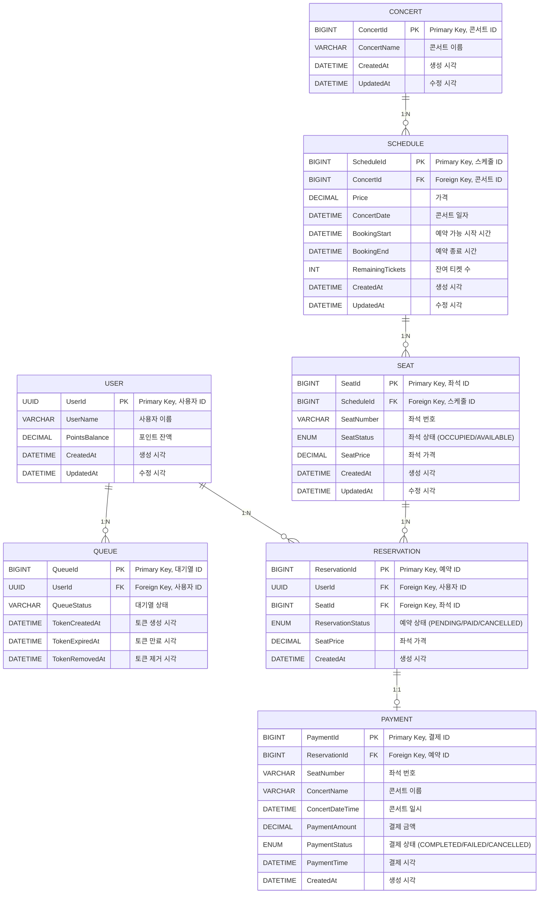

# ERD 작성

# 테이블 간 관계 설명
## 1. 사용자 테이블  ↔ 대기열 테이블
    - 1:N 관계
    - 하나의 사용자는 여러 대기열 기록을 가질 수 있음.
      
## 2. 콘서트 테이블 ↔ 콘서트 스케줄 테이블 
    - 1:N 관계
    - 하나의 콘서트는 여러 개의 스케줄을 가질 수 있음.
    
## 3. 콘서트 스케줄 테이블 ↔ 좌석 테이블
    - 1:N 관계
    - 하나의 콘서트 스케줄에 여러 좌석이 배정됨.
    
## 4. 좌석 테이블 ↔ 예약 테이블 
    - 1:N 관계
    - 하나의 좌석은 여러 예약 상태를 가질 수 있으나, 동시에 점유될 수 없음.
    
## 5. 사용자 테이블 ↔ 예약 테이블 
    - 1:N 관계
    - 하나의 사용자는 여러 예약을 생성할 수 있음.
    
## 6. 예약 테이블 ↔ 결제 테이블 
    - 1:1 관계
    - 하나의 예약은 하나의 결제만 가질 수 있음.
    
## 7. 결제 테이블 ↔ 좌석 테이블 
    - 좌석 번호(`SeatNumber`)와 콘서트 관련 정보는 결제 기록에 저장되지만, 직접 참조되지는 않음.

